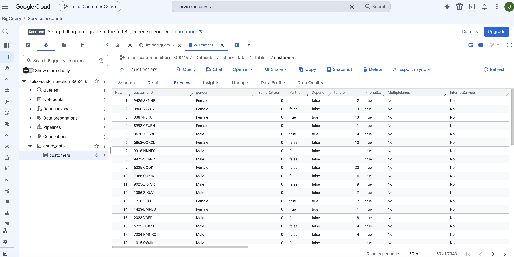
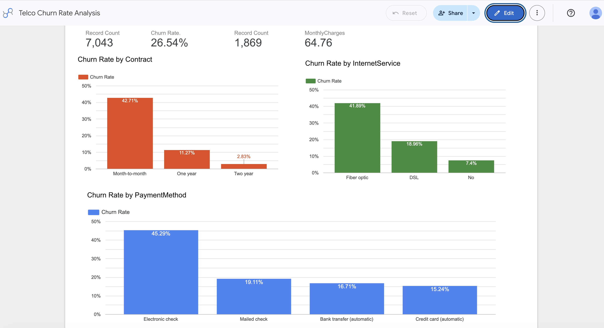
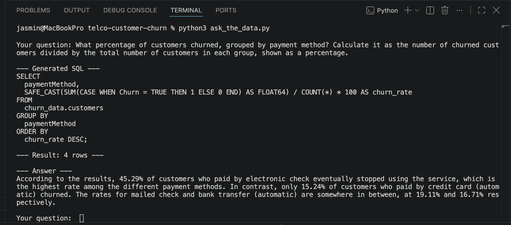

# Ask the Data — AI-Assisted Analytics with a Local LLM

A small analytics tool I built to explore how a local, free LLM (Llama 3.1
via Ollama) can be used as part of a practical data analysis workflow: I
ask a question in plain English, the model writes a BigQuery SQL query,
the script runs it, and the model summarizes the result in plain language.

I built this to practice an AI-assisted analysis workflow end-to-end,
including validating the model's output against ground truth — not just
trusting the answer at face value.

## Why a local model instead of a paid API?

I deliberately chose Llama 3.1 running locally through Ollama instead of
a paid API (Claude, GPT-4) so that:
- The project runs entirely for free, with no API key or billing required
- Anyone can clone this repo and run it end-to-end without signing up for
  a paid service
- It let me directly compare a smaller, free model's SQL-generation
  accuracy against a known-correct baseline (see **Validation** below)

## Architecture

```
Your question (plain English)
        |
        v
  Ollama (Llama 3.1)  --generates-->  SQL query
        |
        v
  Google BigQuery  --executes query, returns rows-->
        |
        v
  Ollama (Llama 3.1)  --summarizes-->  Plain-language answer
```

## Data

[IBM Telco Customer Churn](https://www.kaggle.com/datasets/blastchar/telco-customer-churn)
(public dataset via Kaggle). One row per customer of a fictional telecom
company, including contract type, payment method, monthly charges, and
whether the customer churned.

The dataset loaded into BigQuery, with schema auto-detected from the CSV:



## Setup

1. **Install Ollama** (free, no account needed): [ollama.com](https://ollama.com)
2. **Download the model**:
   ```
   ollama pull llama3.1
   ```
3. **Install Python dependencies**:
   ```
   pip install ollama google-cloud-bigquery --break-system-packages
   ```
4. **Set up a BigQuery project** (free tier / Sandbox mode, no billing required):
   - Create a project at [console.cloud.google.com](https://console.cloud.google.com)
   - Create a dataset and upload the Telco CSV as a table (BigQuery's
     "Auto detect" schema option works out of the box)
   - Create a service account with the "BigQuery Admin" role, and
     download a JSON key for it (**IAM & Admin → Service Accounts → Keys**)
5. **Never commit your key file.** Add it to `.gitignore` before your
   first commit:
   ```
   *.json
   .DS_Store
   ```
6. **Point the script at your own key and project**: open `ask_the_data.py`
   and fill in `PROJECT_ID`, `DATASET`, `TABLE`, and `KEY_FILE` at the top
   with your own values.
7. **Run it**:
   ```
   python3 ask_the_data.py
   ```

## Dashboard

Live churn-rate dashboard (Looker Studio):

https://datastudio.google.com/reporting/f771f438-2dbd-465f-94bb-7dad1be65e3d



## Example questions to try

- "How many customers have a Month-to-month contract?"
- "What is the churn rate for each payment method?"
- "What is the average monthly charge by contract type?"

## Validation — checking the model's work

Since a language model can generate incorrect SQL or drop information
when summarizing, I cross-checked several of its answers against an
independent calculation in pandas:

| Question | Model's answer | Verified (pandas) | Match |
|---|---|---|---|
| Month-to-month contract count | 3,875 | 3,875 | ✅ |
| Total churned customers | 1,869 | 1,869 | ✅ |
| Churn rate — Electronic check | 45.3% (1,071 / 2,365) | 45.3% (1,071 / 2,365) | ✅ |
| Churn rate — Bank transfer | 16.7% (258 / 1,544) | 16.7% (258 / 1,544) | ✅ |
| Churn rate — Credit card | 15% (232 / 1,522) | 15.2% (232 / 1,522) | ✅ |

I also cross-checked the churn rates above against the Looker Studio
dashboard (which queries the same BigQuery table independently via its
own calculated field): Electronic check 45.29%, Month-to-month 42.71% —
consistent with both the model's answers and the pandas calculations
above, aside from minor rounding differences between the three tools.

Here's an example where I asked the question with an explicit formula
(rather than a loosely-worded question), which got the model to compute
the exact same churn rate as the Looker Studio dashboard, down to the
decimal:



**What I learned:** the generated SQL itself was consistently correct
across these tests. However, on a 4-row result (churn rate by payment
method), the model's plain-language summary only mentioned 2 of the 4
payment methods, even though the underlying SQL correctly returned all
four. This is a distinct failure mode from writing wrong SQL — the query
and data were right, but the natural-language summary silently dropped
information. In a real analytics workflow, this means the generated SQL
and raw result table should always be surfaced alongside the summary
(as this script does), so a human can catch omissions like this before
trusting the summary alone.

## Limitations

- Llama 3.1 (8B) is far smaller than commercial models like Claude or
  GPT-4, and makes more SQL syntax errors on complex, multi-condition
  questions — this is a known trade-off of using a free, locally-run model.
- The script has no query cost/complexity guardrails; on a much larger
  dataset, an LLM-generated query could be expensive to run.
- Summaries should always be checked against the raw SQL result shown
  above them, not trusted blindly (see Validation section).
- Error handling distinguishes between SQL errors, Ollama connection
  issues, and Google Cloud authentication problems, so failures are
  easier to diagnose than a single generic error message.

## Tech stack

Python · Ollama (Llama 3.1) · Google BigQuery · pandas (for validation)
